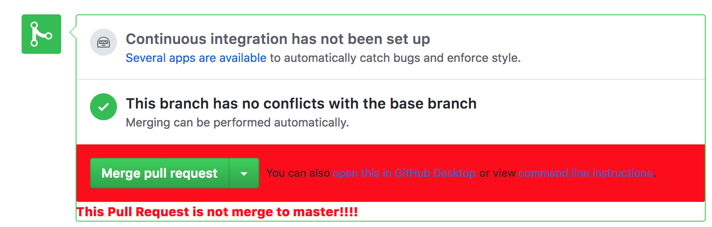

# Github Base Master Checker

[](https://circleci.com/gh/pgmot/gh-base-master-checker/tree/master)

You can avoid merge accident that merge into other branches than master.



## How to install

1. download from release
2. D&D to chrome in `chrome://extensions/`

## Project Structure

* src: TypeScript source files
* dist: Chrome Extension directory
* dist/js: Generated JavaScript files

## Setup

```
npm install
```

## Build in watch mode

### terminal

```
npm run build
```

### Visual Studio Code

Run watch mode.

type `Ctrl + Shift + B`

## Load extension to chrome

Load `dist` directory

